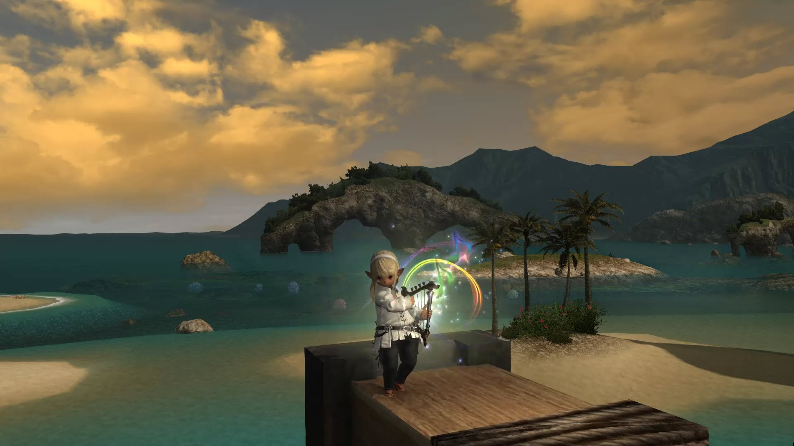

# Game recommendations for Allie

I think what you're doing right now — having Allison play what you play — is the
best strategy. Children tend to develop more respect for (and have better
relationships with) parents who are involved with their hobbies. Plus, you'll be
more empathetic when they struggle, and they'll think you're a total badass when
you can help them with difficult segments : D

## Starting out

Let's see. According to Winry's gaming spreadsheet, it looks like we started at
two years old. She would sit on my lap when I played and learned from my many
deaths in games like Mega Man Unlimited that dying was part of the learning
process and making mistakes is the fastest path toward mastery. So she got into
gaming with a strong mindset.

As she got a little older, she enjoyed playing various Mario games (Super Mario
3D World, Super Mario Galaxy 2, Super Mario Bros. U, Mario Kart 8) and learned
to read from Pokémon at around age 4½. There was a lot of repetitive gardening
and battle text in Pokémon Black, so she built confidence through reading lines
like "Squirtle uses Water Gun!" or "You watered the seed. The soil is moist!"
347328901 times.

She did
[Metroid: Zero Mission](https://en.wikipedia.org/wiki/Metroid:_Zero_Mission)
around that time and really enjoyed being Samus and exploring the map for hidden
power-ups and secret areas. A year later she played a fan remake of the second
Metroid game, AM2R. Metroid games are tense and atmospheric, so she would have
to put her bravery hat on. Nevertheless, she was always very excited about
making progress and [finding new items](https://youtu.be/-mhABaHTI_w).

Recently we started the latest installment of the Metroid series, Dread, as a
family!

She also liked [Journey](https://store.steampowered.com/app/638230/Journey/)
and [Flower](https://store.steampowered.com/app/966330/Flower/), which were more
open-ended exploration games that had very simple mechanics.

Winry had fun early on
with [Pokémon Art Academy](https://www.nintendo.com/games/detail/pokemon-art-academy-3ds/)
and [Art Academy](https://www.nintendo.com/games/detail/art-academy-lessons-for-everyone-3ds/)
, learning about digital art and using layers in her compositions on her 3DS.
This helped her transition
to [Procreate](https://apps.apple.com/us/app/procreate/id425073498) later on the
iPad for all of her handwriting and proof writing.

There's a cute Mario themed puzzle game
called [Captain Toad](https://www.nintendo.com/games/detail/captain-toad-treasure-tracker-switch/)
which is a charming 3D puzzler for both the Switch and the 3DS.
The [Box Boy](https://www.nintendo.com/games/detail/boxboy-and-boxgirl-switch/)
series of games on the Switch and 3DS were a huge hit with both, especially
because the one on the Switch was co-op (
although playing together without getting frustrated certainly took practice.)

## Educational games

[Dragonbox](https://dragonbox.com/) was amazing. I think this series of
educational games helped the kids really understand math and numbers past
memorizing a bunch of symbols on paper.
[Dragonbox Elements](https://www.youtube.com/watch?v=rm-6pDiSH44) in particular
was a brilliant way to introduce geometry concepts in sneaky ways. You start
with a basic triangle and gradually build up the foundations to do visual proofs
by unlocking new powers or constructions like the perpendicular bisector,
rhombus, or interior angle theorem.

The [Dragonbox Algebra](https://dragonbox.com/products/algebra-5) games teach
kids how to manipulate equations by performing the same action on each side of
the screen without realizing they are doing algebra. By the end they solve
complex Algebra I equations by replacing the pictures of animals and plants they
were using with actual numbers and variables. Sneaky.

To supplement, we also taught the kids binary counting very early and freely
intermixed binary and decimal in conversation so they realized the base 10
system is completely arbitrary. Many birthday candles were done in binary, and I
often had them count in increasing binary numbers when they had to count to wait
for something.

[Dragonbox Chess](https://www.youtube.com/watch?v=e2k6EKdyJMw) was also a cute
RPG-like way to introduce the kids to
chess. [No Stress Chess](https://www.amazon.com/Winning-Moves-Games-Stress-Chess/dp/B0007Q1IO4)
was the next logical step, where you reduce complexity by limiting moves only to
the piece cards you draw from a randomized deck, and gradually increase your
options by drawing extra cards or following extra rules.

I've been kind of surprised with chess. I thought it was a "solved" game because
of AIs, but it's both fun and tactical. All four of us play, and all of us are
terrible.

## Rhythm games

The kids loved rhythm games, which ended up being a sneaky way to introduce them
to music. In [Patapon](https://www.youtube.com/watch?v=D3Hz4hIjeDs), you have
four drums that you beat to tell your small army to attack, defend, and perform
combat maneuvers versus giant cartoon
monsters. [Theatrhythm](https://www.youtube.com/watch?v=nUWXodOjzbI) has
wonderful Final Fantasy music and encouraged Cody to explore a lot of songs on
the piano. Having listened to Final Fantasy music all their lives as lullaby
music at night, they were delighted to be so familiar with the songs and be able
to play along. Much of the music is present in Final Fantasy XIV, a triple-A
MMORPG the four of us now play as a family. 

The scoring system in Theatrhythm actually ended up being a foundation of 
self-improvement and goal setting. To this day all of their problem sets and 
timed activities like getting ready for the morning and taking baths are 
based off of the same  F, D, C, B, A, S, SS, SSS scoring system. For 
example, here is a clip of their calculus page:

[Crypt of the Necrodancer](https://store.steampowered.com/app/247080/Crypt_of_the_NecroDancer/)
and its Legend of Zelda themed
spin-off, [Cadence of Hyrule](https://www.nintendo.com/games/detail/cadence-of-hyrule-crypt-of-the-necrodancer-featuring-the-legend-of-zelda-switch/)
were also good rhythm / RPG hybrids.

## How Cody got into music

A few months after Cody turned 3, Final Fantasy XIV released a musical
instrument performance patch! For me, this was exciting as I wanted to program
some scripts to play songs for myself, but for Cody this was the beginning of an
amazing journey. He begged me to let him accompany me as I tried out melodies
and chords with my character's harp.

Eventually we set him up with [Yousician](https://youtu.be/0lWLZ4vp_ls), which
helps you establish good practice habits while gamifying your practice sessions
with points and achievements.

Back then, you could upload your own scores in musicXML format and practice
whatever you wanted! But they sadly removed that feature. Yousician has its own
set of issues, though. Without a teacher or parent to supervise technique, you
can pick up a lot of awful habits quickly.

## 6-10

As a 6 Winry started enjoying bigger RPGs like
[Breath of the Wild](https://www.zelda.com/breath-of-the-wild/) and
[Horizon: Zero Dawn](https://www.playstation.com/en-us/games/horizon-zero-dawn/)
.

Horizon made a deep impression on her, partially, I think, because you begin the
story as a six-year-old girl who grows up to be very smart and resourceful,
surviving in wilderness filled with mysterious high-tech machines. This game
taught Winry a lot about group dynamics and ethics.

Many of these games are on the 3DS, which makes for great entertainment during
car rides.

co-op games. Overcooked.

FFXIV. adv story with politics, but good mmo mechanics. 4 player party.

Contraption Maker is something Bob might remember. I think it's from the makers
of the original Incredible Machine, a physics based puzzle game with every-day
objects.

Infinifactory.

There are also great games in VR that both kids enjoyed. Puzzling Places is a
good 3D puzzle game where you literally put together puzzle pieces in 3D. Cubism
and Gadgeteer were huge hits with both kids, as were Moss, Fujii, and Down the
Rabbit Hole. Beat Saber is a great exercise game, as was Ring Fit for Nintendo
Switch. ➜ Just Dance!

Recently the kids both did ALBA, Equilinox and In Other Waters, all very naturey
/ biology related games.

As Allison gets older you can consider playing historical games with her, like
the Assassin's Creed or Total War series. Right now, Age of Empires IV.

We also enjoyed many indie classics throughout the years with the kids, like
Hollow Knight, Celeste (Cody spent 7 months playing through the OST for that),

how P5 is a good family reading experience.

Problem solving: developing critical thinking skills and building a growth mindset

  FTL: Faster than Light

  

Biology: appreciating nature and animals

  Equilinox
  In Other Waters
  Alba: a Wildlife Adventure

  

Virtual Reality: reducing clutter and having fun with spatial perception

    VR is a great way to reduce clutter of physical toys and engage spatial perception skills! Here are a few the kids have enjoyed over the years:

  

